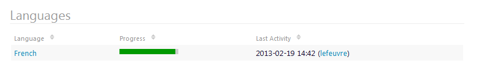
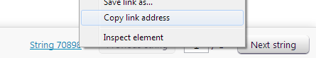

Translate Novius OS
###################

Novius OS is ready to be translated into any language (It has already been translated into French and Japanese). Here is the process to translate Novius OS into your language.

Remember `we are here to help <http://forums.novius-os.org/en/want-translate-novius,15.html>`__. Your contribution is very appreciated, thank you.

Beginners guide
***************

The best way to quickly get started with Novius OS translation is to focus on the front-office texts (~220 words only). They shouldn’t take you more than an hour to translate. Here are the steps to follow:

1. Go to `translate.novius-os.org <http://translate.novius-os.org>`__.
2. In the projects’ list (on the right-hand side), click the latest version of Novius OS. On the next page, if your language is not listed, just `contact us <http://forums.novius-os.org/en/want-translate-novius,15.html>`__, we'll add it for you.
3. There are only four files to translate:
    * Blog application: :file:`noviusos_blognews > front.po`
    * Forms application: :file:`noviusos_forms > front.po`
    * Comments application: :file:`noviusos_comments > front.po`
    * Core: :file:`framework > front.po`

That’s it, you’re done! Many thanks for your contribution. Now, if you feel like translating more, that’d be fantastic. Just keep reading.

Copy style guide
****************

We take copywriting and translation very seriously. We have therefore established guidelines common to all applications and languages in order to provide every Novius OS user with consistent and enjoyable copy.

* :doc:`copy_style_guide`
* :ref:`Charte rédactionnelle (Français) <fr:contribute/copy_style_guide>`
* :ref:`スタイルガイド（日本語）<ja:contribute/copy_style_guide>`

The copy style guide is to be read by every translator. If it's not available in your language then it is the first document to translate.

.. note::
    We're happy to have the style guide translated by a professionnal translator. This key document may indeed prove hard to localise. `Contact us <http://forums.novius-os.org/en/want-translate-novius,15.html>`__ about this translation.

Translation server
******************

Novius OS translation server is available at `translate.novius-os.org <http://translate.novius-os.org>`__. It is powered by `Pootle <http://pootle.translatehouse.org>`__. Here is a quick guide to Pootle. (You may also want to have a look at `Evernote's handy tour of Pootle <http://translate.evernote.com/i/tour/>`__.)

Available languages
===================

If on :file:`translate.novius-os.org` home page, your language is not listed under :guilabel:`Languages`, just `contact us <http://forums.novius-os.org/en/want-translate-novius,15.html>`__. We'll add it for you.

Translation files
=================

Once your language is available on :file:`translate.novius-os.org`, click it. Then click the version of Novius OS you want to translate. If you don't know which one to choose, `ask us <http://forums.novius-os.org/en/want-translate-novius,15.html>`__, we'll tell you.

You now see a list of directories. The directories starting with :file:`noviusos_` are applications. :file:`framework` contains the strings from the core.

.. image:: images/pootle-nos-directories.png
	:alt: Translation directories
	:align: center

To start translating, don't click :guilabel:`Continue translation` but a number in the :guilabel:`Need translation` column. This allows you to choose a directory. Please follow these priorities:

* Top priority, the core: :file:`framework`.
* Then the native applications: Webpages (:file:`noviusos_pages`), Media Centre (:file:`noviusos_media`), Users (:file:`noviusos_user`) and Applications manager (:file:`noviusos_appmanager`).
* And finally the non-native applications.

Suggesting and submitting translations
======================================

Everybody can suggest translations. A suggestion will be reviewed by an approved translator before being submitted. Only submitted translations are applied to Novius OS. Unreviewed or rejected suggestions stay in Pootle.

.. note::
    You don't even need to create an account to suggest translations. Nevertheless creating an account only takes you a minute and allows you to select your languages and avoid the CAPTCHA protection.

Being an approved translators is a great way to make a difference to the Novius OS project. Everyone can apply: Just `drop us <http://forums.novius-os.org/en/want-translate-novius,15.html>`__ a few lines about yourself and include your Pootle username. We'll review your application before granting you extended permissions.

When translating
****************

Placeholders and tags
=====================

* Some strings include variables, e.g. ``‘Welcome back, {{user}}’``. Obviously, Novius OS end users don't see these variables which are replaced by the actual value, e.g. ``‘Welcome back, Joe’``. Variables are to be kept, untranslated, e.g. ``‘Re-bonjour {{user}}’``.
* HTML tags are also to be kept and not to be translated. In most cases, you'll find a start tag and an end tag, e.g. ``‘This page has <strong>one sub-page</strong>’``. Text between tags must be translated, e.g. ``‘Cette page a <strong>une sous-page</strong>’``.
* For non-breaking spaces, please use the HTML entity, i.e. ``&nbsp;``.

Dispelling doubts
=================

Don't translate in the dark! When you don't understand a string, need to know the context or have any doubt, please `contact us <http://forums.novius-os.org/en/want-translate-novius,15.html>`__. Our job is to make translation easy. We're happy to add notes to translator in the translation files for others to benefit from your feedback. We can also provide you with screenshots or indications to find a string in the UI of Novius OS.

When your question or comment regards a specific string, please give us the link to the string. You'll find it the bottom right corner:

Translating the documentation
*****************************

This documentation is powered by `Read The Docs <http://readthedocs.org/>`__ which uses Rich Structured Text (RST) files. This format is human-readable and therefore easier to translate.

If on this `page <http://www.novius-os.org/developpers/Documentation.html>`__, your language is not listed under :guilabel:`Translations`, `contact us <http://forums.novius-os.org/en/want-translate-novius,15.html>`__. We'll set up the GitHub repo for you.

Once the repo is ready, clone it. You may also want to clone the `English repo <http://github.com/novius-os/documentation-en/>`__ so you can copy files from the original version to the translation.

That's it, you're all set to start translating. Thank you very much for your contribution!