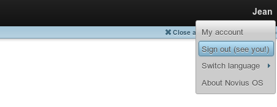

Setup wizard
============

You've followed the :doc:`first part of the installation process <install>`. Novius OS files are now installed, the
server is set-up and you accesses http://your.domain/novius-os/. You've done the hardest, now comes the easy part :-).

Step 1: Checking requirements
-----------------------------

This step should be straightforward if you've installed Novius OS following the quick procedure. In other cases, don't
worry if a lof of red comes up! Your website just needs writing permissions in some directories. This step gives you
the explanations and the commands to run to fix everything.

.. image:: images/step-1a.png
	:alt: Step 1a
	:align: center

To fast-track this step, just copy the commands' summary given at the bottom of the page and copy them in a terminal. You're done!

.. image:: images/step-1b.png
	:alt: Step 1b
	:align: center

Step 2: Setting up the MySQL database
-------------------------------------

You need a MySQL database including a user with the required rights. For shared hosting, your provider must have given
you these details. In other cases, here is an example for a ``localhost`` database:

.. code-block:: sql

    CREATE DATABASE `your_db_name` DEFAULT CHARACTER SET utf8 COLLATE utf8_general_ci;
    GRANT ALL PRIVILEGES ON `your_db_name`.* TO 'your_user_name'@localhost IDENTIFIED BY 'your_password';
    FLUSH PRIVILEGES;

Fill in these four fields according to your database configuration.

.. image:: images/step-2.png
	:alt: Step 2
	:align: center

This will create two files :file:`local/config/db.php` and :file:`local/config/crypt.php` and—more importantly-the
tables needed for Novius OS to run.

Step 3: Creating the first administrator account
--------------------------------------------------

.. image:: images/step-3.png
	:alt: Step 3
	:align: center

Step 4: Finishing the installation
----------------------------------

.. image:: images/step-4.png
	:alt: Step 4
	:align: center

.. warning::

    We urge you to follow the recommendation of this page.

    On setting contexts, refer to the :doc:`principles </understand/multi_context/principles>` and :ref:`API documentation <api:php/configuration/software/multi_contexts>`.

Applications
------------

You're redirected to the applications manager. Install the applications you need.

.. image:: images/step-appmanager.png
	:alt: Applications manager
	:align: center

Signing in and out
------------------

To sign out, click your name in the top-right corner. A menu shows:

You're redirected to the sign-in form.

.. image:: images/step-login-b.png
	:alt: Signing in
	:align: center