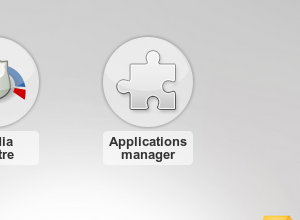

Applications
============

Thanks to the applications, you can add new features to Novius OS.

The applications manager
------------------------

Allows you to install and uninstall applications.

After modifying the ``metadata`` of an application or your website (Novius OS' instance), you must apply the changes in the applications manager. This is also the case when a native application has been modified.

.. image:: images/applications/application-manager.png
	:alt: Le gestionnaire d'applications
	:align: center