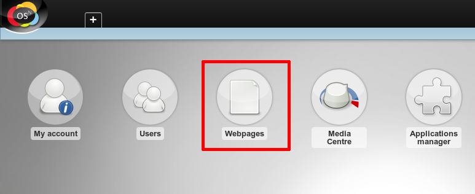
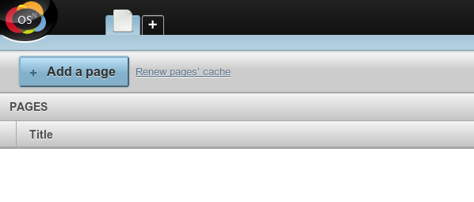
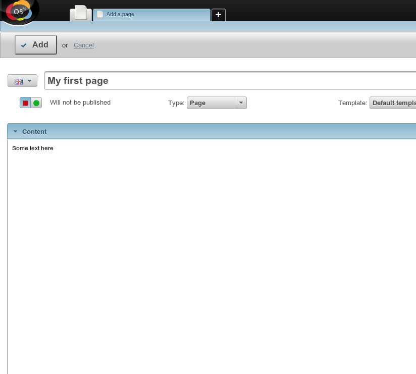
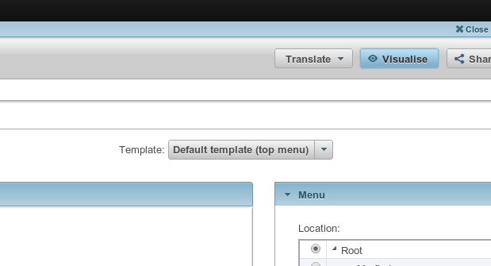
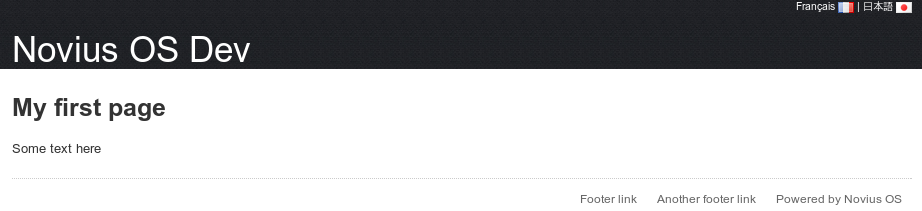

First page
==========

Open the Webpages application
-----------------------------

If you want create a website, go to the **Webpages** application:

Add your first page
-------------------

Wirte some content and hit ‘Add’
-------------------------------

Preview your work
-----------------

The **Visualise** action allows you to preview the page before publishing it.

Publish your page
-----------------

Once you're happy with work, choose ‘Will be published’ and save.

Look in awe at what you've achieved:

